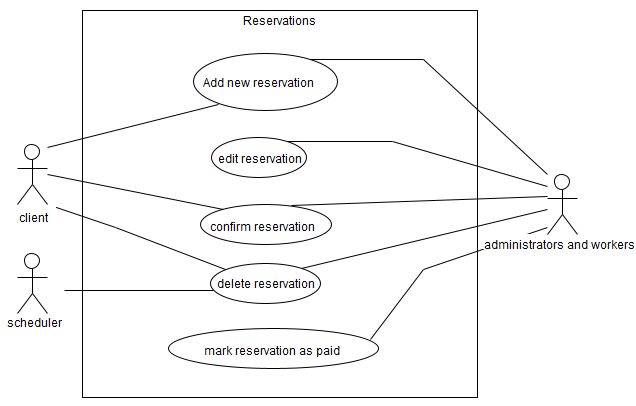
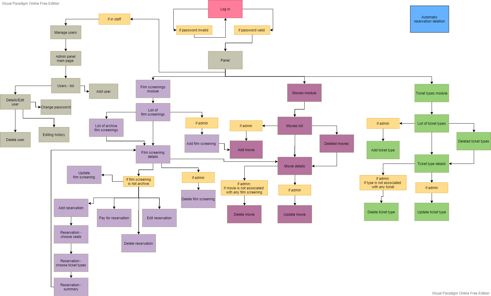
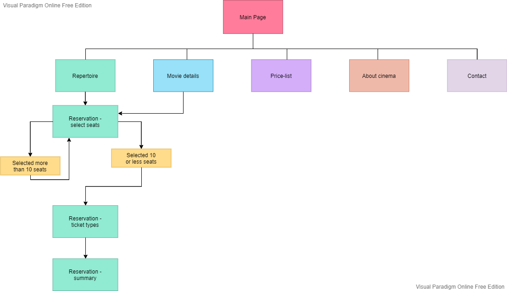
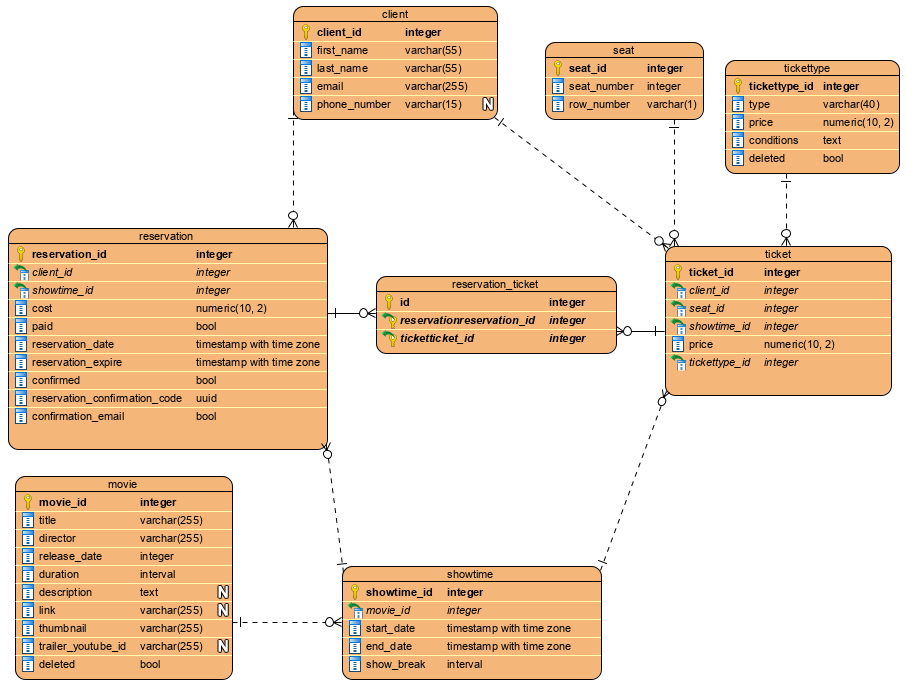
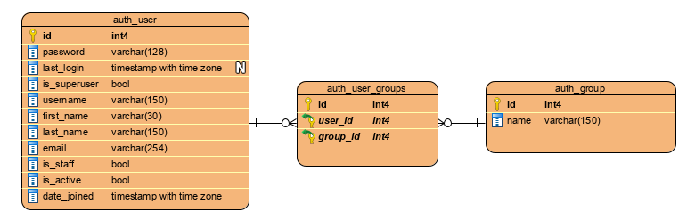

### Reservation and content management system for local cinema.

My bachelor's degree project.

The main goal of this project was to improve process of seats reservation in small, local cinema. This app focus mainly
on reservation system and does not include payments. Client has to pay physically in cinema before film screening
starts.    
In this application I implemented simplified additional functionalities which allows managing cinema's page in range of
adding new movies, creating film screenings, changing ticket prices and managing worker's accounts.

#### Application consists of two main modules:

###### Module for cinema's workers

The main purpose of this module is system administration. It consists of a couple of mini-modules which are used for
data manipulation which client sees:

* Film shows module - allows browsing, creating, editing and deleting existing film screenings which happened and will
  happen. If film show already happened system doesn't allow adding new reservation to it. Deleting film show also
  deletes reservations, tickets and client's data associated with deleting show. When user opens show details sees basic
  information about it and associated reservation. This place also allows managing reservations.

* Movies module - allows browsing, creating, editing and deleting movies which cinema plays and movies which cinema
  stopped playing. If cinema stops showing movie then worker which has administration privileges can mark is as deleted.
  When movie is marked as deleted no one can create film show associated with this movie.

* Ticket types module - allows browsing, creating, editing and deleting ticket types which cinema is offering. It is
  similar to movies module. System administrator can block assigning ticket types to seat during reservation process.

* Managing user accounts module - allows browsing, creating, editing and changing passwords. Basically it's simplified
  built in Django administration module.

###### Module for clients

Client's module consists of five pages and reservation form.

* About page - basic information about cinema and its offer.
* Contact - contact information
* Main page - Film screenings which will happen within 14 days since today. Clicking on movie thumbnail redirects to
  movie details page which also has a list of film shows for this movie which will happen in the nearest future.
* Repertoire - The nearest film shows with screening dates and links which redirects to reservation form.
* Pricing - current active ticket types, prices and additional information (e.g. required documents for discount)
* Reservation - form which allows seats reservation for chosen movie.

---------

## Technologies

* Jenkins
* docker
* docker-compose

Testing:

* pytest
* selenium (selenium grid)
* Jmeter

Production/Staging environment:

* Python 3.7
* Django
* PostgreSQL
* SendGrid
* Azure AppService
* Azure Storage
* Azure Logic Apps

Dev environment:

* Python 3.7
* Django
* PostgreSQL
* mailcow-dockerized (https://github.com/mailcow/mailcow-dockerized)
* Gunicorn
* Apache server
* Crontab

---------

## Users

Application contains simplified accounts and permission system which has two predefined groups - workers and
administrators. Administration users have almost full access to application (except "managing users" module). Workers
can only access to part of functionalities. The table below shows users permissions.

System has also one additional role for managing user accounts. Only user who has checked flag "in staff" in Django
admin panel can manage user's accounts. Role works properly only if user:

* is in 'Administrators' group,
* is in staff.

### Table of worker's permissions

|Functionality|Action|Admins Group|Workers group|
|---|:---:|:---:|:---:|
|Manage users|-|X|X|
|Film screening||||
| |create|V|V|
| |update|V|V|
| |browse|V|V|
| |delete|V|X|
|Reservations (and tickets)||||
| |create|V|V|
| |update|V|V|
| |browse|V|V|
| |delete|V|V|
|Movies||||
| |create|V|X|
| |update|V|X|
| |browse|V|V|
| |delete|V|X|
|Ticket types||||
| |create|V|X|
| |update|V|X|
| |browse|V|V|
| |delete|V|X|

### Automatic reservation deletion

Automatic reservation deletion is handled by Azure Logic Apps. Azure service triggers scheduler which invokes GET
request to `/worker/cron/usun-rezerwacje` endpoint every 10 minutes. Endpoint call invokes function on server side which
is responsible for deleting all expired reservations without `confirmed` flag set to True in database. This happens
every 10 min.

Reservation expires 30 min after it was created. Until this time it needs to be confirmed it order to get `confirmed`
flag.

The Use case diagram below shows users and their possible actions.    

### Module sitemaps

#### Site map of worker module

     
Created with [https://online.visual-paradigm.com](https://online.visual-paradigm.com)

#### Site map of client module

     
Created with [https://online.visual-paradigm.com](https://online.visual-paradigm.com)

-----------

## Database structure

Structure of cinema tables:     

Structure of default django tables which contains groups and users:      

-----------

## Mails

Application sends emails in the following cases:

* after client makes seats reservation (mail contains: client's personal data, information about the show, booking
  price, reservation disapproval and approval link),
* after employee updates information about film screening (contains movie title new starting and ending date),
* after employee creates or edits reservation (email to client is optional, message contains same information as message
  about creating new reservation by client),
* after automatic reservation deletion (message contains only information that reservation has been deleted).

---------

## Making reservation

Client can make reservation in 3 ways:

* by cinema's website (online reservation with confirmation email),
* by phone call (client can ask employee to confirm his reservation or send him an email with reservation summary and
  approval link),
* in the cinema.

---------

## Required environmental variables

* SECRET_KEY – django secret key used for cryptographic operations
* NAME – DB name,
* USER – DB user,
* PASSWORD – DB password,
* HOST – DB host,
* PORT – DB port,
* EMAIL_HOST_USER – email address used for sending emails,
* SENDGRID_API_KEY – access key for SendGrid account,
* AZURE_ACCOUNT_NAME – Azure Storage service name,
* AZURE_ACCOUNT_KEY – access key for storage service access,
* AZURE_CUSTOM_DOMAIN – URL for Azure storage service,
* AZURE_LOCATION – container name which is used for store files,
* AZURE_CONTAINER - container name which is used for store files.

----------

## Tests

Test cases for manual testing:   
https://docs.google.com/spreadsheets/d/1waFV-8ZkhgdNZUMMdUEsn7iaLLuMzJ9fWcIrPRdYdkg/edit#gid=0

## CI/CD

todo    
